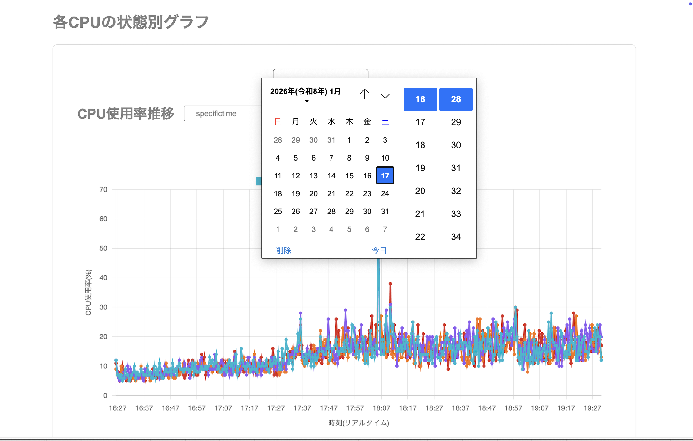

# CPU Usage Monitor

CPU の使用率をリアルタイムで収集・可視化するシステムです。高速検索とメモリ効率を重視した設計により、
大量のメトリクスデータを効率的に処理します。



## 特徴

- **リアルタイムモニタリング**: 10 秒間隔で CPU 使用率を収集
- **多段階集計**: 10 分/30 分/1 時間/1 日の 4 パターンで事前集計および任意の日付範囲指定が可能
- **高速検索**: 事前集計方式により表示時の検索処理を最適化
- **RESTful API**: FastAPI による柔軟なデータ取得
- **スケーラブル**: 最大 16CPU、月間 400 万件のデータに対応可能

## システムアーキテクチャ

```
データ収集 → データ蓄積 → データ集計 → データ表示
InsertMetrics → cpu_load → CreateSummary → API/Frontend
```

### データベース構造

**生データテーブル (cpu_load)**

- 10 秒間隔で収集される CPU 使用率の生データ
- 全カラム INTEGER 型で高速検索を実現

**集計テーブル (cpu_load_summary)**

- 事前集計された統計データ（平均/最大/最小/件数）
- 複合インデックスにより高速な範囲検索が可能

## セットアップ

### 必要な環境

- Python 3.8 以上
- pip
- SQLite3（Python に標準搭載）

### インストール

```bash
# 依存パッケージのインストール
pip install fastapi uvicorn psutil

```

### データベースの初期化

```bash
# プロジェクトルートからdataディレクトリの作成
mkdir -p data

# backendディレクトリに移動して初期化
cd backend
python connection.py
```

## ローカルサーバでの動作確認

### 1. FastAPI サーバの起動

```bash
# backendディレクトリに移動
cd backend

# 開発モード（自動リロード有効）
uvicorn server:app --reload --host 0.0.0.0 --port 8000

```

### 2. ブラウザでアクセス

```
# フロントエンド画面
http://localhost:8000/frontend/static/index.html
```

### 3. 動作確認

**ステップ 1: メトリクスデータの収集開始**

```bash
# backendディレクトリで実行
cd backend
python insert.py
```

**ステップ 2: 集計データの作成**

```bash
# 集計処理を実行（10分間隔: index=0）
curl -X POST "http://localhost:8000/api/summary?index=0"

# 1時間間隔の場合
curl -X POST "http://localhost:8000/api/summary?index=2"
```

**ステップ 3: データの確認**

```bash
# リアルタイムデータ取得
curl "http://localhost:8000/api/metrics?mode=realtime"

# 集計データ取得（例: 過去1時間、現在はダミーデータ）
curl "http://localhost:8000/api/summary?start_timestamp=1750920000&end_timestamp=1750923600"
```

## API 仕様

### メトリクス関連

#### GET /api/metrics

生データを取得します。

**パラメータ:**

- `mode` (string, optional): デフォルトは "realtime"

**レスポンス例:**

```json
{
  "cpu0": [
    { "timestamp": 1750922781, "utilization": 45 },
    { "timestamp": 1750922841, "utilization": 52 }
  ],
  "cpu1": [{ "timestamp": 1750922781, "utilization": 38 }]
}
```

#### POST /api/metrics

新規メトリクスデータを投入します。

**リクエストボディ:**

```json
{
  "timestamp": 1750922781,
  "cpu_id": 0,
  "utilization": 45
}
```

**レスポンス例（成功）:**

```json
{
  "status": "success",
  "inserted": 1
}
```

**レスポンス例（失敗）:**

```json
{
  "status": "error",
  "message": "データ挿入に失敗しました"
}
```

### 集計データ関連

#### GET /api/summary

集計データを取得します（現在はダミーデータを返却）。

**パラメータ:**

- `start_timestamp` (int, required): 開始時刻（UNIX 秒）
- `end_timestamp` (int, required): 終了時刻（UNIX 秒）
- `cpu_id` (int, optional): 特定の CPU を指定（現在未使用）

**注意:** 現在は実際の集計データではなく、ダミーデータを生成して返却しています。

- 指定期間内に 10 個のデータポイントを等間隔で生成
- CPU 0-3 の 4 つの CPU のダミーデータを生成
- 各 CPU は異なるベース値（25, 30, 35, 40）+ ランダム変動で生成

**レスポンス例:**

```json
[
  {
    "bucket_timestamp": 1750920000,
    "cpu_id": 0,
    "avg_utilization": 45,
    "sample_count": 15
  },
  {
    "bucket_timestamp": 1750920000,
    "cpu_id": 1,
    "avg_utilization": 52,
    "sample_count": 18
  }
]
```

#### POST /api/summary

集計処理を実行します。

**パラメータ:**

- `index` (int, optional): 集計間隔インデックス（デフォルト: 0）
  - 0 = 10 分（600 秒）
  - 1 = 30 分（1800 秒）
  - 2 = 1 時間（3600 秒）
  - 3 = 1 日（86400 秒）

**注意:** `server.py`では`seconds`パラメータも定義されていますが、実際の`create_summary_data()`メソッドでは`index`のみを使用しています。

**レスポンス例（成功）:**

```json
{
  "status": "success",
  "created": 76
}
```

**レスポンス例（失敗）:**

```json
{
  "status": "error",
  "message": "集計データ作成に失敗しました"
}
```

## プロジェクト構成

```
CPU-Usage-Monitor/
├── backend/
│   ├── server.py           # FastAPIサーバ（メインアプリケーション）
│   ├── insert.py           # データ収集・挿入クラス（InsertMetrics）
│   ├── summary.py          # 集計処理クラス（CreateSummary）
│   ├── connection.py       # データベース接続クラス（ConnectMetrics）
│   ├── utils/              # ユーティリティモジュール
│   └── venv/               # バックエンド用仮想環境
├── data/
│   ├── metrics.db          # SQLiteデータベースファイル
│   ├── metric.jsonl        # メトリクスログファイル
│   └── jsonl_viewer.html   # JSONLビューア
├── frontend/
│   └── static/             # フロントエンド静的ファイル
│       ├── index.html
│       ├── css/
│       └── js/
├── tests/
│   └── test.py             # テストコード
├── venv/                   # プロジェクト全体の仮想環境
├── README.md
└── 設計書.md
```

## データベース設計

### データベース: SQLite3

- **ファイルパス**: `../data/metrics.db`
- **最大 CPU 数**: 16 (cpu0 ~ cpu15)
- **自動初期化**: ConnectMetrics クラスのインスタンス化時に自動でテーブル作成

### テーブル: cpu_load

```sql
CREATE TABLE IF NOT EXISTS cpu_load (
    id INTEGER PRIMARY KEY,
    timestamp INTEGER NOT NULL,  -- UNIX秒
    cpu_id INTEGER,               -- CPU識別番号 (0-15)
    utilization INTEGER           -- CPU使用率 (0-100)
);
```

### テーブル: cpu_load_summary

```sql
CREATE TABLE IF NOT EXISTS cpu_load_summary (
    id INTEGER PRIMARY KEY,
    bucket_timestamp INTEGER,     -- バケット開始時刻
    interval_type INTEGER,        -- 時間間隔 (0=10分, 1=30分, 2=1時間, 3=1日)
    cpu_id INTEGER,
    avg_utilization INTEGER,      -- 平均CPU使用率
    max_utilization INTEGER,      -- 最大CPU使用率
    min_utilization INTEGER,      -- 最小CPU使用率
    sample_count INTEGER          -- サンプル数
);

-- 検索高速化のための複合インデックス
CREATE INDEX IF NOT EXISTS index_bucket_type_cpu_id
ON cpu_load_summary(bucket_timestamp, interval_type, cpu_id);
```

## 開発時の注意点

### データ収集頻度

- 生データは 10 秒間隔で収集
- 1 日あたり: 4CPU × 8,640 回 = 34,560 件
- 将来拡張時: 16CPU × 8,640 回 = 138,240 件/日

### 集計処理タイミング

- **現在**: 手動実行（`create_summary_data()` メソッド）
- **将来計画**: タスクスケジューラで 1 時間毎に自動実行

### インデックス戦略

- `cpu_load_summary`テーブルには複合インデックスを設定
- `cpu_load`テーブルは更新頻度が高いためインデックスなし

### パフォーマンス最適化

- 全カラム INTEGER 型で検索速度とメモリ効率を優先
- 事前集計方式により表示時の計算負荷を削減
- テーブル分離により目的別の最適化を実現

## トラブルシューティング

### サーバが起動しない

```bash
# ポートが使用中の場合は別のポートを指定
uvicorn server:app --reload --port 8001
```

### データベースが見つからない

```bash
# プロジェクトルートからdataディレクトリの作成
mkdir -p data

# backendディレクトリに移動してデータベースの初期化
cd backend
python connection.py
```

### データが表示されない

1. データベースファイル (`data/metrics.db`) が存在するか確認
2. メトリクス収集スクリプトが実行されているか確認
3. 集計処理が実行されているか確認

### SQLite データベースの確認

```bash
# SQLiteコマンドラインツールで確認
sqlite3 data/metrics.db

# データ確認
SELECT * FROM cpu_load LIMIT 10;
SELECT * FROM cpu_load_summary LIMIT 10;

# 終了
.quit
```

## 使用技術

- Python 3.8+
- FastAPI
- SQLite
- Uvicorn

## 環境構築

このプロジェクトをローカルで動作させるための手順です。

### 前提条件

- Python 3.8以上がインストールされていること
- Gitがインストールされていること

### セットアップ手順

#### 1. リポジトリのクローン

```bash
git clone https://github.com/yourusername/cpu-monitoring-system.git
```

#### 2. ディレクトリに移動

```bash
cd cpu-monitoring-system
```

#### 3. 仮想環境の作成

```bash
python -m venv venv
```

#### 4. 仮想環境の有効化

**macOS/Linux:**

```bash
source venv/bin/activate
```

**Windows:**

```bash
venv\Scripts\activate
```

#### 5. 必要なパッケージのインストール

```bash
pip install fastapi uvicorn psutil
```

#### 6. アプリケーションの起動

```bash
uvicorn main:app --reload --host 0.0.0.0 --port 8000
```

※初回起動時にデータベースとテーブルが自動的に作成されます

#### 7. アプリケーションへのアクセス

メインアプリケーション: http://localhost:8000/frontend/static/index.html
